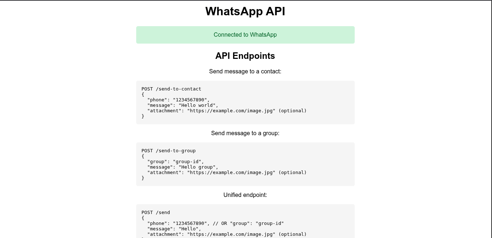

## [i] Preview


## [i] Requirements
```
npm ^10.9.2
nodejs ^22.13.1
```

## [i] How to use

### Install the package

```
npm install
```

### Run the app

```
node server.js
```

### Usage
```
1. Run the server.js
2. Open The Browser
3. Goto http://localhost:3000
4. Open Whatsapp in your phone > Goto Setting > Linked Device
    > Add Device > Scan the QR that have generated from step 3.
5. Youre ready to go to use your API server
```